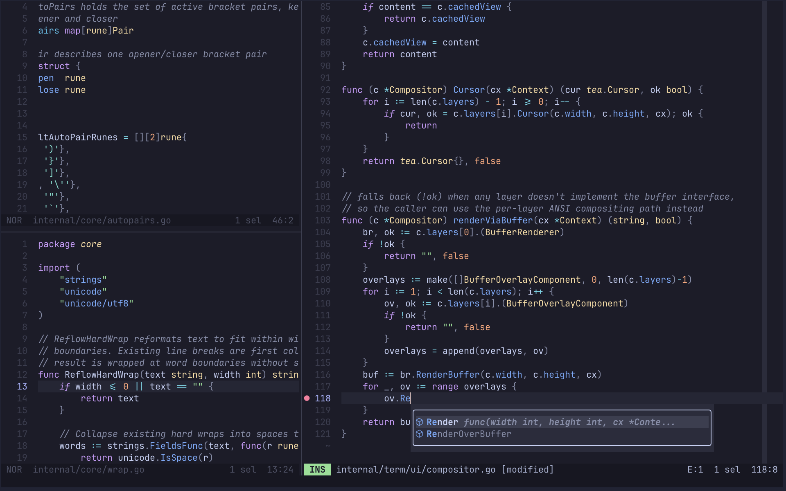

# Thom's Own Editor (toe) 

 [](https://qlty.sh/gh/kode4food/projects/toe) [](https://qlty.sh/gh/kode4food/projects/toe) [](https://github.com/kode4food/toe/blob/main/LICENSE)

**toe** is a modal terminal editor for Go development. toe edits Go projects, not the universe.

Experimental but usable. Keep your work in Git or another backup.



## Super Opinionated

toe is opinionated because it is built for one tight workflow: editing Go projects from a terminal without growing into a general-purpose IDE. It favors modal editing, `gopls`, TOML config, project-local state, Git diff gutters and a changed-file picker, and a small set of deliberate defaults over plugin sprawl or endless knobs.

- Modal editing: normal, insert, and selection modes; multi-cursor editing; undo and redo
- Project navigation: multiple buffers, split views, fuzzy file/buffer pickers, global search, file and diff previews, image panes, and an integrated terminal pane
- Go-focused language tooling: syntax highlighting, LSP completion, hover, signature help, formatting, symbols, code actions, rename, go-to navigation, and diagnostics
- Editor display: soft wrap, rulers, whitespace rendering, indent guides, gutters, configurable cursor shapes, and statusline elements
- Version control: git diff gutters, changed-hunk navigation and reset, and a changed-file picker with unified diff previews
- Project state: workspace trust, user/workspace TOML config, EditorConfig, session persistence, external file change detection, and clean-buffer reloads
- 4 Catppuccin themes: frappe, latte, macchiato, mocha

## Requirements

- Go 1.26 when building from source
- A terminal with ANSI color support
- `gopls` on `PATH` for Go language features
- A Kitty graphics capable terminal
- Nerd Font glyphs for enhanced UI

## Install

Install the latest stable release with Homebrew (recommended):

```sh
brew install kode4food/tap/toe
```

To build the current source:

```sh
make build    # writes to dist/toe
make install  # installs to $GOPATH/bin
```

## Usage

```sh
toe
toe path/to/file.go
toe file1 file2
toe path/to/project
```

When the first argument is a directory, toe uses it as the project root.

## Configuration

```text
$XDG_CONFIG_HOME/toe/config.toml
$XDG_CONFIG_HOME/toe/languages.toml
```

Workspace config goes in `.toe/config.toml` and `.toe/languages.toml` at the project root.

Workspace config is trust-gated. See `docs/content/docs/configuration.md` for details.

```text
:workspace-trust
:workspace-untrust
```

## Development

```sh
make pre-commit   # run this before committing
make test
make coverage
```

## Acknowledgements

toe is possible because of excellent terminal UI, parsing, syntax highlighting, and theme projects:

- [Christian Rocha](https://github.com/meowgorithm) and the [Charm team](https://charm.land/) for [Bubble Tea](https://github.com/charmbracelet/bubbletea), which gives toe its TUI runtime, input handling, and renderer
- [Max Brunsfeld](https://github.com/maxbrunsfeld) and the [Tree-sitter project](https://tree-sitter.github.io/tree-sitter/) for the incremental parsing stack, official Go bindings, and grammars behind toe's Tree-sitter highlighting
- [Alec Thomas](https://github.com/alecthomas) and the [Chroma project](https://github.com/alecthomas/chroma), the pure-Go syntax highlighter toe uses as its highlighting fallback
- [Pocco](https://github.com/pocco81) and the [Catppuccin project](https://catppuccin.com/) for the Latte, Frappe, Macchiato, and Mocha palettes. toe ships only Catppuccin themes because I love them and I don't care if you don't ;-)
